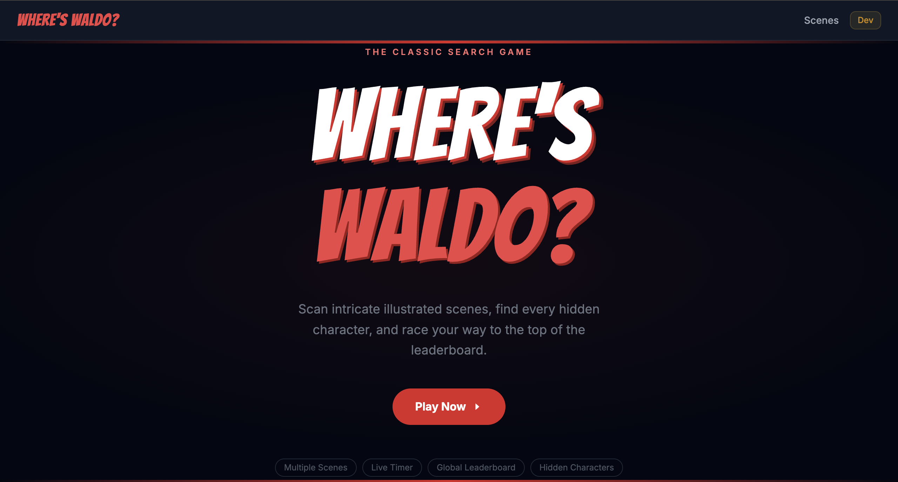
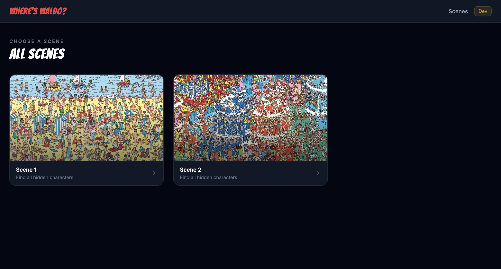
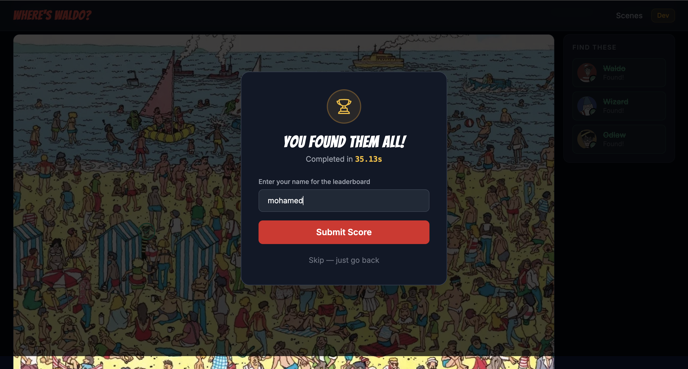

# Where's Waldo? 🎯

A full-stack photo tagging game built with Next.js, Prisma, PostgreSQL, and TypeScript.

Players must find hidden characters within large scenes by clicking on the image and selecting the character they believe they found. The game validates selections on the server, tracks completion times, and displays scene-specific leaderboards.

---

## Live Demo

https://where-s-waldo-pj64-7lvx6hbb5-mohamedmosilhys-projects.vercel.app/

---

## Screenshots

### Home Page



### Scene Selection



### Gameplay




### Leaderboard


---

# Features

## Gameplay

- Multiple scenes to play
- Hidden characters in each scene
- Click-to-target interaction
- Character selection menu
- Real-time validation
- Scene completion tracking
- Completion timer

## Leaderboards

- Scene-specific leaderboard
- Fastest completion times displayed
- Player name support
- Automatic score recording

## Responsive Design

- Desktop support
- Tablet support
- Mobile support

## Security

Character coordinates are never exposed to the client.

Validation is performed entirely on the server.

The client only receives:

- Scene data
- Character names
- Character ids

Hidden validation data remains protected in the database.

---

# Tech Stack

## Frontend

- Next.js App Router
- React
- TypeScript
- Tailwind CSS
- Zustand

## Backend

- Next.js Server Actions
- Prisma ORM

## Database

- PostgreSQL

## Deployment

- Vercel

---

# Architecture

The application follows a feature-based architecture.

```text
src/
├── app/
├── components/
├── features/
│   ├── game/
│   ├── leaderboard/
│   ├── player/
│   └── scenes/
├── lib/
├── store/
└── types/
```

Each feature owns its own:

- Components
- Actions
- Types
- State
- Business logic

This keeps responsibilities separated and makes the application easier to scale.

---

# Database Design

## Image

Represents a playable scene.

```text
Image
├── id
├── name
└── url
```

---

## Character

Represents a hidden character.

```text
Character
├── id
└── name
```

---

## ImageCharacter

Join table containing validation coordinates.

```text
ImageCharacter
├── imageId
├── characterId
├── centerX
├── centerY
└── radius
```

Coordinates are stored as normalized values between:

```text
0 → 1
```

This allows validation to work correctly across different screen sizes.

---

## Score

Stores completed runs.

```text
Score
├── playerName
├── completionTime
├── imageId
└── createdAt
```

---

# Coordinate Normalization

A major challenge in this project was supporting multiple screen sizes.

Instead of storing pixel coordinates:

```text
x = 842
y = 416
```

the application stores normalized coordinates:

```text
x = 0.421
y = 0.208
```

Calculated using:

```ts
normalizedX = clickX / imageWidth;
normalizedY = clickY / imageHeight;
```

This guarantees consistent validation regardless of screen size.

---

# Validation System

When a player selects a character:

1. Frontend sends:
   - imageId
   - characterId
   - normalized x
   - normalized y

2. Server retrieves:
   - centerX
   - centerY
   - radius

3. Validation checks whether the click falls inside the character's bounding area.

4. Server returns:

```json
{
  "success": true
}
```

or

```json
{
  "success": false
}
```

No secret coordinates are ever sent to the client.

---

# State Management

Global state is managed with Zustand.

Examples:

```text
playerName
gameCompleted
```

Local UI state remains local using React state.

Examples:

```text
menuOpen
selectedCharacter
clickedPosition
foundCharacters
```

This prevents unnecessary global state.

---

# Local Development

## Clone Repository

```bash
git clone <repository-url>
cd where-s-waldo
```

---

## Install Dependencies

```bash
pnpm install
```

---

## Environment Variables

Create a `.env` file:

```env
DATABASE_URL="your_database_url"
```

---

## Run Migrations

```bash
npx prisma migrate dev
```

---

## Seed Database

```bash
pnpm prisma db seed
```

---

## Start Development Server

```bash
pnpm dev
```

Application:

```text
http://localhost:3000
```

---

# Production Deployment

The project is deployed on Vercel.

Build process:

```bash
prisma generate
next build
```

Database:

```text
PostgreSQL
```

Hosting:

```text
Vercel
```

---

# Lessons Learned

This project involved several interesting engineering challenges:

- Feature-based architecture
- Prisma relationship modeling
- Coordinate normalization
- Secure server-side validation
- State ownership decisions
- Timer implementation
- Leaderboard design
- Full-stack deployment

The biggest architectural lesson was separating:

```text
UI State
```

from

```text
Application State
```

and ensuring sensitive game logic remained on the server.

---

# Future Improvements

Potential enhancements:

- Found-character markers on images
- Toast notifications
- User accounts
- Global leaderboard
- Achievement system
- Scene categories
- Admin scene creation dashboard
- Image upload and automatic calibration tools

---

# Author

Mohamed Mosilhy

Built as part of The Odin Project curriculum.
